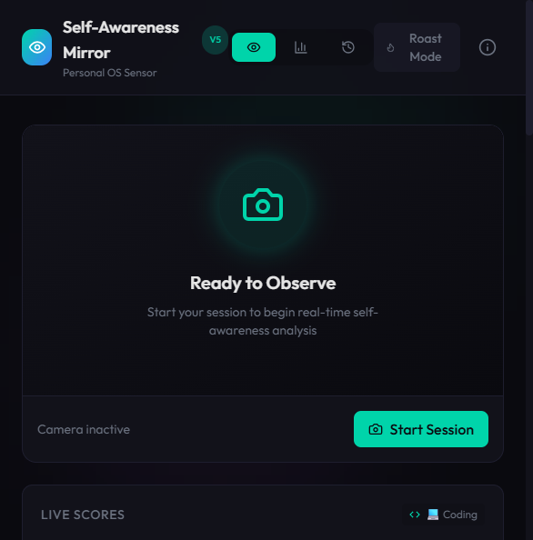
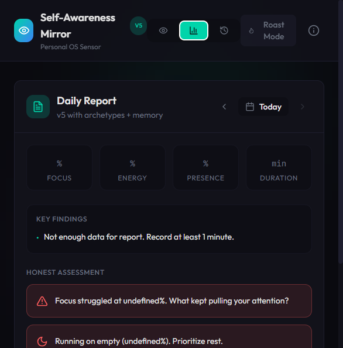

# 🪞 AI Self-Awareness Mirror

**Real-time self-awareness feedback powered by computer vision and AI.**

A personal "OS sensor" that observes you through your webcam and provides blunt, honest feedback on your **focus**, **energy**, and **presence** — all processed locally in your browser.



## ✨ Features

### Core Metrics (Real, Not Random)
- **Focus (0-100)** — Face presence, gaze stability, head pose, look-away detection
- **Energy (0-100)** — Blink rate, eye openness (EAR), micro-movement, yawn detection
- **Presence (0-100)** — Camera engagement, head position, posture indicators

### v5 Features: Personal OS Sensor
- **🎯 Context Modes** — Coding, Reading, Meeting, Brainstorm (each with different thresholds)
- **📈 Auto-Tuning** — Thresholds learn from YOUR history using P10-P90 percentiles
- **🔇 Event De-dup** — Cooldowns + merge logic prevent timeline spam
- **🏷️ Session Archetypes** — "Locked In", "Fatigue Drift", "Distracted Spiral", etc.
- **🧠 Report Memory** — Tracks last 10 reports, varies wording if repeating issues
- **📊 Signal Quality** — Shows measurement confidence, freezes scores when tracking is poor
- **💭 Smart Look-Away** — Distinguishes "thinking" from "distracted" based on motion patterns

### Daily Reports


- Session archetype classification (Locked In, Choppy Focus, Fatigue Drift, etc.)
- Driver analysis (Distraction, Fatigue, Restlessness percentages)
- Non-repetitive insights with memory
- One actionable recommendation per session

### Other Features
- **Calibration System** — 35-second personalized baseline capture
- **Events Timeline** — Real-time detection of focus streaks, distractions, energy dips
- **Roast Mode** — Brutally honest feedback (toggle on/off)
- **Observed Modes** — Behavioral states: Deep Focus, Distracted, Fatigued, Thinking, etc.
- **Privacy First** — All processing local, no video transmitted

## 🛠️ Tech Stack

- **Frontend**: React 18 + Vite
- **Styling**: Tailwind CSS + Framer Motion
- **Computer Vision**: MediaPipe FaceMesh (468-point face tracking)
- **Charts**: Chart.js
- **Database**: Supabase (optional, works offline)
- **Icons**: Lucide React

## 🚀 Getting Started

### Prerequisites
- Node.js 18+
- npm or yarn
- Webcam

### Installation

```bash
# Clone the repository
git clone https://github.com/KeldrickD/Self-Awareness-Mirror.git
cd Self-Awareness-Mirror

# Install dependencies
npm install

# Start development server
npm run dev
```

Open [http://localhost:5173](http://localhost:5173) in your browser.

### Environment Variables (Optional)

Create a `.env` file for Supabase integration:

```env
VITE_SUPABASE_URL=your_supabase_url
VITE_SUPABASE_ANON_KEY=your_supabase_anon_key
```

The app works fully offline without Supabase.

## 📖 How It Works

### Scoring System

All scores are based on **measurable signals**, not guesswork:

| Metric | Signals Used |
|--------|-------------|
| Focus | Face presence %, gaze stability, head pose stability, look-away events |
| Energy | Blink rate trends, eye openness (EAR), micro-movement, yawn detection |
| Presence | Camera engagement, head position, face visibility, posture |

### Calibration

The 35-second calibration captures your personal baselines:
1. **Phase A (15s)**: Neutral face, normal posture
2. **Phase B (10s)**: Look left/right to set gaze thresholds
3. **Phase C (10s)**: Optional speech baseline

### Context Modes

| Mode | Description |
|------|-------------|
| 💻 Coding | Stability matters, thinking look-aways tolerated longer |
| 📖 Reading | Balanced thresholds |
| 🎙️ Meeting | Stricter away penalties, confidence weighted higher |
| 🧠 Brainstorm | Very relaxed, movement is fine |

### Session Archetypes

At session end, you're classified as:
- 🎯 **Locked In** — Deep work achieved
- 📊 **Choppy Focus** — Good periods, but fragmented
- 😴 **Fatigue Drift** — Started strong, faded
- ⚡ **Restless Sprint** — High energy but fidgety
- 🌀 **Distracted Spiral** — Attention pulled away
- 📡 **Low Signal** — Tracking unreliable

## 🔒 Privacy

- **100% Local Processing** — MediaPipe runs in your browser
- **No Video Storage** — Only aggregated metrics saved (optionally)
- **No Cloud AI** — Everything computed on your device

## 📁 Project Structure

```
├── src/
│   ├── components/
│   │   ├── WebcamFeed.jsx      # Camera display + face mesh overlay
│   │   ├── MetricRing.jsx      # Animated gauge rings
│   │   ├── ObservedMode.jsx    # Behavioral state display
│   │   ├── DailyReport.jsx     # Session reports + archetypes
│   │   ├── Calibration.jsx     # Calibration overlay
│   │   ├── EventsTimeline.jsx  # Real-time event feed
│   │   ├── ContextMode.jsx     # Activity context selector
│   │   └── RoastMode.jsx       # Brutally honest feedback
│   ├── hooks/
│   │   ├── useWebcam.js        # Webcam management
│   │   ├── useFaceDetection.js # MediaPipe integration
│   │   └── useSession.js       # Session state
│   ├── lib/
│   │   ├── faceAnalysis.js     # Core scoring engine (v5)
│   │   └── supabase.js         # Database client
│   └── App.jsx                 # Main application
├── public/
├── screenshots/
└── package.json
```

## 🤝 Contributing

This is a personal project, but feel free to fork and customize for your own use!

## 📜 License

MIT License — use it however you want.

---

**Built for personal productivity tracking. No judgment, just data.**
